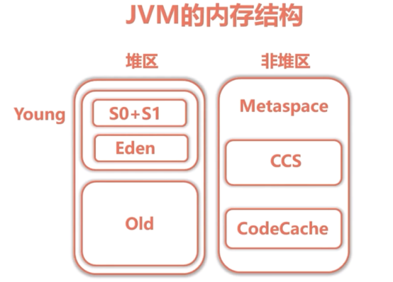
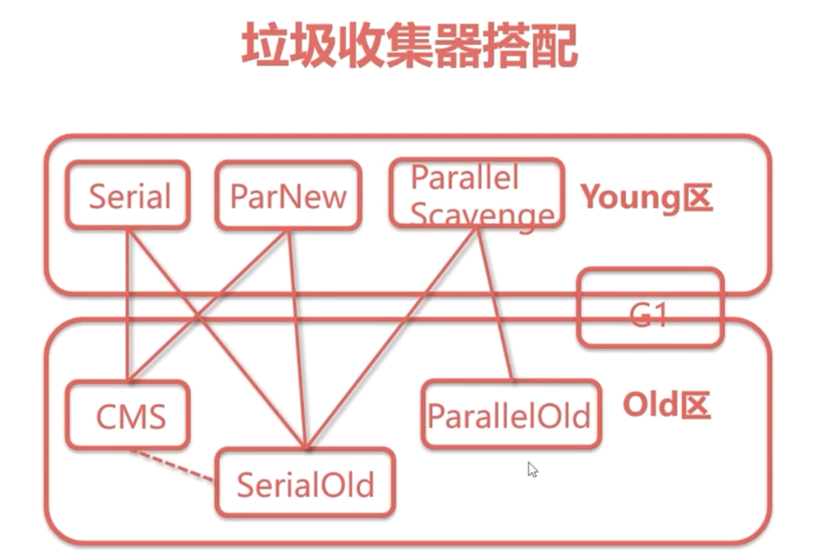

# 基于JDK的命令行监控工具
## JVM的参数类型
### 标准参数
1. -help
2. -server -client
3. -version -showversion
4. -cp -classpath

### X参数(非标准参数)
1. -Xint:解释执行
2. -Xcomp:第一次使用就编译成本地代码
3. -Xmixed:混合模式

### XX参数
1. Boolean类型
* 格式：-XX[+-]<name>
* 例子：-XX+UseConcMarkSweepGC  //启用CMS垃圾收集器
	   -XX+UseG1GC				//启用G1收集器
2. -Xms //初始化堆大小
3. -Xmx //最大的堆大小

## 运行时JVM参数查看
1. -XX:+PrintFlagsFinal
```shell
>java -XX:+PrintFlagsFinal -version 
//得到如下类似输出(表示启动上面个这java进程时的参数)
     bool UseFastEmptyMethods                       = false                               {product}
     bool UseFastJNIAccessors                       = true                                {product}
     bool UseFastStosb                              = true                                {ARCH product}
     bool UseG1GC                                   = false                               {product}
     bool UseGCLogFileRotation                      = false                               {product}
     .....
```
=表示默认值
:= 被JVM修改后的值
2. jps(专门用来查看java进程的)
3. jinfo
* 格式：jinfo -flag [参数名] PID
* 例子：jinfo -flag MaxHeapSize 
```shell
C:\Users\Yush>jps -l
4440 org.elasticsearch.bootstrap.Elasticsearch
6348 sun.tools.jps.Jps

C:\Users\Yush>jinfo -flag MaxHeapSize 4440
-XX:MaxHeapSize=134217728

C:\Users\Yush>jinfo -flag UseG1GC 4440 //是否启动了G1GC
-XX:-UseG1GC							//没有启动
```

## jstat查看虚拟机统计信息
1. -class 类装载信息 
* 格式：jstat -class PID 1000 5
* 说明：每隔1000毫秒打印一次，打印5次
```
C:\Users\Yush>jstat -class 4440 1000 5
Loaded  Bytes  Unloaded  Bytes     Time
 10465 18697.9        0     0.0      18.30
 10465 18697.9        0     0.0      18.30
 10465 18697.9        0     0.0      18.30
 10465 18697.9        0     0.0      18.30
 10465 18697.9        0     0.0      18.30
 //Loaded :加载类的个数
 //用了内存 KB
 //Unloaded ：卸载的类
 //
```
2. 垃圾收集
* jstat -gc PID 
```
>jstat -gc 4440

S0C、S1C：S0的总量
S1U、S1U：S1的使用量
EC、EU：Eden区总量和使用量
OC、OU:Old区的总量和使用量
MC、MU:metaspace区的总量和使用量
CCSC、CCSU:压缩类空间总量和使用量
FGC、FGCT:发生full gc的次数和时间
YGC、YGCT:发生young gc的次数和时间
GCT:总的GC时间
```
3. JVM内存结构

4. jstat -compiler PID
5. jstat -printcompilation PID

## jmap+MAT与内存溢出
1. 代码实验堆溢出和非堆溢出（运行时设置相关的参数）
2. 导出内存映像文件
* 内存溢出自动导出
```
-XX:+HeapDumpOnOutOfMemoryError
-XX:HeapDumpPath=./
```
* jmap命令手动导出
```
jmap -dump:format=b,file=heap.hprof PID
``` 
3. 使用MAT工具使用

## jStack
1. 命令格式 jstack PID
2. 线程状态
* NEW
* RUNNABLE
* BLICKED
* WAITING
* TIMEMD_WAITING
* TEEMINATED
3. 实验：jstack 定位死锁与死循环

# 基于JVisualVM的可视化监控
* 具体打开再看，安装了两个插件

注意安装插件要先根据JDK版本更新地址
* https://visualvm.github.io/pluginscenters.html
* visualGC插件
* JvisualVM监控本地jAVA进程
* JvisualVM监控远程Tomcat
1. 修改Catalina.sh
```shell
//添加配置
JAVA_OPTS="$JAVA_OPTS -Dcom.sun.management.jmxremote.port=9004 //端口不冲突即可
-Dcom.sun.management.jmxremote.ssl=false
-Dcom.sun.management.jmxremote.authenticate=false'
-Djava.rmi.server.hostname=192.168.231.12  //远程主机IP
```
* [官方文档](https://visualvm.github.io/documentation.html)
`https://visualvm.github.io/documentation.html`

# 基于Btrace的监控调试
* 动态修改运行中程序的字节码
* JavaComplierApi等技术
1. 下载Btrace [github地址](https://github.com/btraceio/btrace)
2. 新建环境变量
`BTRACE_HOME `
`PATH %BTRACE_HOME%\bin`
3. 两种运行的方式
* 在JvisualVM中添加Btrace插件
* 命令行中执行 btrace <PID> <trace_script>
```java
//需要引入三个jar包在btrace的build目录下有
//Btrace脚本示例
import com.sun.btrace.AnyType;
import com.sun.btrace.BTraceUtils;
import com.sun.btrace.annotations.BTrace;
import com.sun.btrace.annotations.Kind;
import com.sun.btrace.annotations.Location;
import com.sun.btrace.annotations.OnMethod;
import com.sun.btrace.annotations.ProbeClassName;
import com.sun.btrace.annotations.ProbeMethodName;

@BTrace
public class PrintArgSimple {
	
	@OnMethod(
	        clazz="com.qh.controller.UserController",
	        method="arg1",
	        location=@Location(Kind.ENTRY)
	)
	public static void anyRead(@ProbeClassName String pcn, @ProbeMethodName String pmn, AnyType[] args) {
		BTraceUtils.printArray(args);
		BTraceUtils.println(pcn+","+pmn);
		BTraceUtils.println();
    }
}


```
4. 使用详解
* 拦截方法
```
普通方法
@onMethod(clazz="",method="")
构造函数
@onMethod(clazz="",method="<init>")
//同名函数用anyRead方法的参数列表区分即可
```
* 拦截时机
```
Kind.ENTRY 入口
Kind.RETURN 返回
Kind.THROW 异常
Kind.Line 行

```
* 拦截this、参数、返回值
```
this @Self
入参 可以用AnyType 也可以用真是类型
返回值 @Return
```
* 其他
1. Btrace默认只能本地运行
2. 被修改的字节码在进程重启之前是不会被还原的

# Tomcat性能监控与调优
* 暂时不学这个

# Nginx性能监控与调优
## 安装nginx
1. 修改yum
```
vi /etc/yum.repos.d/nginx.repo
[nginx]
name=nginx repo
baseurl=http://nginx.org/packages/centos/7/$basesearch/
gpgcheck=0
ecabled=1
```
2. 安装
`yum install nginx`
3. 启动
```
//启动
nginx
nginx -s reload
nginx -s 
```

## ngx_http_stub_status配置
```
location = /nginx_status {
	stub_status on;
	access_log off;
	allow 127.0.0.1;
	deny all;
}
```

## ngxtop
1. 安装python-pip
yum install epel-release
yum install python-pip
2. 安装ngxtop 
pip install ngxtop

## nginx-rrd
1. 安装php的依赖
```
yum install php php-gd php-soap php-mbstring php-xmlrpc php-dom php-fpm -y
```
2. php整合nginx
```
vi /etc/php-fpm.d/www.conf
user = apace => user = nginx
group = apace => group = nginx
```

3. 开启php-fpm
```
systemctl start php-fpm
//添加配置
location ~\.php$ {
	root /usr/share/nginx/html;
	fastcgi_pass 127.0.0.1:9000;
	fast_index index.php;
	fastcgi_param SCRIPT_FILENAME $document_root/$fastcgi_script_name;
	include fastcgi_params;
}
```
4. 安装
```
yum install perl rrdtool perl-libwww-perl libwww-perl perl-rrdtool -y
下载 rrdtool
```
`全七八糟的全在装工具、用到了再说 、不细看了`
## Nginx优化
1. 增加工作线程和并发连接数
```
worker_processes 4; #工作进程数 受限于cpu 
events{
	worker_connections 1024;#每个进程可以打开的最大连接（包括nginx和客户端、nginx和upstream之间的连接）
	multi_accept on;#可以一次建立多个连接
	use epoll;# epoll > poll > select
}

```
2. 启用长连接
//nginx与客户端的长连接默认是65秒

upstream server_pool{
	keepalve 300; #nginx与后台服务器之前的长连接（默认是没有的）
}

3. 启用缓存、压缩
```
gzip on;
```
4. OS系统优化
```
#配置/etc/sysctl.conf
sysctl -w net.ipv4.tcp_syncookies=1#防止一个套接字在过多试图连接时引起过载
sysctl -w net.core.somaxconn=1024#连接队列 默认128
sysctl -w net.ipv4.tcp_fin_timeout=10#timawait的超时时间（把它调小就可以尽快的断掉这个连接，建立新的连接）
sysctl -w net.ipv4.tcp_tw_reuse=1#OS直接使用timawait的连接 
sysctl -w net.ipv4.tcp_rw_recycle=0#回收禁用（一般都关闭）
#/etc/security/limits.conf
hard nofile 204800
soft nofile 204800
soft core unlimited
soft stack 204800

#其他
sendfile	on;减少文件应用和内核之间的拷贝
tcp_nopush	on;当数据包达到一定大小再发送
tcp_nodelay	off;#有数据随时发送
```

# JVM层GC调优
## JVM内存结构
1. 运行时数据区
* 程序计数器 PC 线程私有

* JAVA虚拟机栈 

每一个线程创建的时候都会新建一个栈，每一次方法的调用都会创建一个栈帧（用于存储局部变量表、操作数栈、动态链接、方法出口等信息）
* 本地方法栈

为虚拟机使用到Native方法服务
* 堆(线程共享的)

* 方法区

线程共享的，用于已被虚拟机加载的类信息、常量、静态变量、即时编译器编译后的代码数据（在Java虚拟机规范中把方法区描述成为堆的一个逻辑部分，但是有时有称方法区为"非堆"）,对应jdk8中的metaspace区，对应JDK7中的永久区

常量池：（方法区的一部分）常量池是Class文件的一项信息（Class文件主要包括类版本、字段、方法、接口等描述信息和常量池）用于存放编译期生成的各种字面量和符号引用
CCS：32位指针的Class
通过`-XX:+UseCompressendClassPointers`开启短直针 
CodeCache:JIT编译后的本地代码、JNI使用的C代码
2. 常用参数
* -Xms 最小堆内存
* -Xmx 最大堆内存
* -XX:NewSize 新生代的大小
* -XX:MaxNewSize 最大新生代大小
* -XX:NewRatio 新生代(young)/老年代的比例
* -XX:SurvivorRatio  两个Surviivor(s0+s1)/eden的比例
* -XX:MetaspaceSize 
* -XX:+UseCompressedClassPointers 启用短直针

## 垃圾回收算法

* 思想：枚举根节点做可达性分析
* 根节点
1. 类加载器
2. Thread
3. 虚拟机栈的本地变量表
4. static成员
5. 本地方法栈的变量
6. ……

###常用算法
1. 标记清楚
缺点产生碎片、碎片太多会导致提前GC
2. 复制
3. 标记整理
标记完了之后将所有存活的对象移动到一端，然后清除掉边界以外的内存

### 分代垃圾回收
* Young区用复制算法
* Old区用标记-清楚或者标记整理

### 对象分配
* 对象优先分配在Eden区

* 大对象直接进入老年代

大对象的大小通过 `-XX:pretenureSizeThreshold`指定

* 长期存活的对象进入老年代

-XX：MaxTenuingThreshold

-XX:PrintTenuringDistribution

-XX:TargetSurvivorRation


## 垃圾搜集器

### 串行收集器Serial
* 单线程的收集器
* 适用于内存较小的嵌入式设备
* -XX:+UseSerialGC #新生代启用串行
* -XX:+UseSerialOldGC  //上一参数开启会默认将老年代也设置串行收集

### 并行收集器Parallel
* 吞吐量优先
* 吞吐量：GC耗时/应用总时间的占比`-XX:GCTimeRatio=<n>`,吞吐量=1/(1+n)
* 并行：指垃圾收集线程之间可以并行工作（用户线程仍处于等待状态）
* 适用于后台处理等交互较弱的场景
* -XX:UseParallelGC //开启并行收集器，相同于同时开启了-XX:+UseParallelOldGC
* Server模式下是默认收集器

### 并发收集器Concurrent
* 停顿时间优先，使用web应用程序
* 停顿时间：垃圾收集器做垃圾回收中断应用的时间 `-XX:MaxGCPauseMillis`指定最大停顿时间
* 并发：指用户线程和垃圾收集器同时执行（可能是交替运行，区别操作系统的并发）
* JDK8中有两个并发收集器CMS和G1
* 开启CMS  -XX:+UseConcMarkSweepGC（老年代） -XX:+UseParNewGC(年轻代)
* 开启G1   -XX:+UseG1GC
* JDK8中已经推荐使用G1收集器


### 如何选择垃圾收集器
* 优先调整堆的大小，让服务器自己来选择
* 内存<100MB 使用串行收集器

## 可视化GC日志分析工具


## Tomcat的GC调优实战

# JVM字节码与Java代码层调优

# 课程总结


