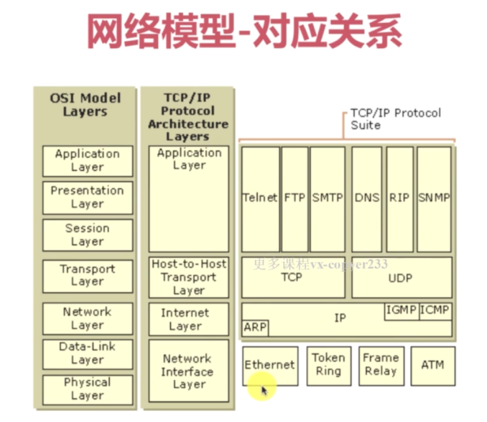

socket网络编程
---

#Socket网络编程快速入门


* socket:IP地址与端口号的结合协议，对TCP/IP协议API的总称
* 代码：Socket服务端与客户端聊天demo

## 基本概念（略）
* IPV6 128位 （64位网络前缀和64位主机地址）主机地址通常根据物理地址自动生成

#Socket UDP（略 有空再看）

## 为什么不可靠
1. 一旦把数据发送出去就不保留数据备份
2. UDP在IP数据的头部仅仅加入了复用和数据校验字段
3. 发送端生产数据，接收端从网络中抓取数据（不需要连接）
4. 结构简单、无检验、速度快、容易丢包、可广播。

## 最大可发送数据大小

> 2^16-1-8 = 65507 byte

## UDP的作用

* DNS、TFTP、SNMP
* 视频、音频、普通数据（下载得用TCP）
 
## DatagramSocket
## DatagramPacket

## 单播、广播、多播（组播）

* 广播只能在一个路由器下广播

###广播地址
* 255.255.255.255 为受限的广播地址
* 广播地址运算 
```
IP:192.168.124.7
子网掩码：255.255.255.255
网络地址：IP & 子网掩码 = 192.168.124.0
广播地址：（最后一个可用地址）192.168.124.255
```


#Socket TCP

#UDP辅助TCP实现点对点传输案例

#简易聊天室案例

#服务器传输优化-NIO

#数据传输稳定性优化

#局域网文件快传技术实战

#聊天室升级版实战

#语音数据即时通信实战


#整体代码结构梳理与升华


#总结与参考资料